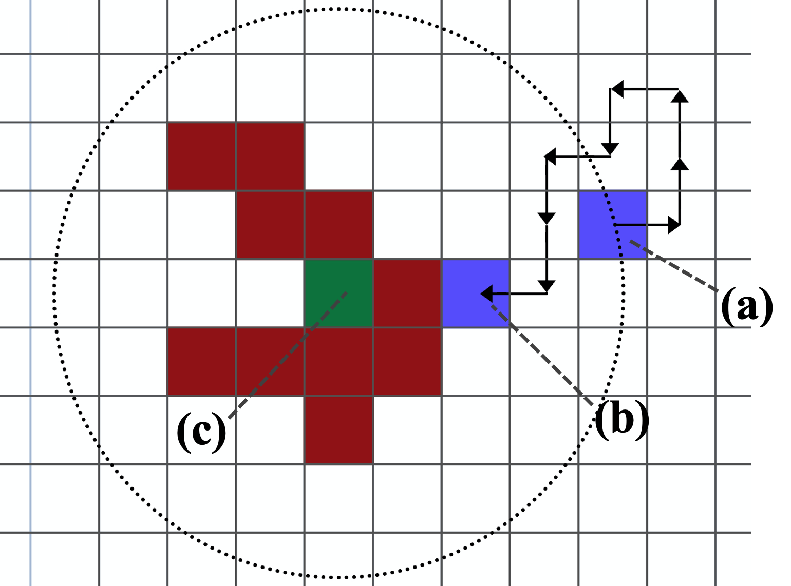
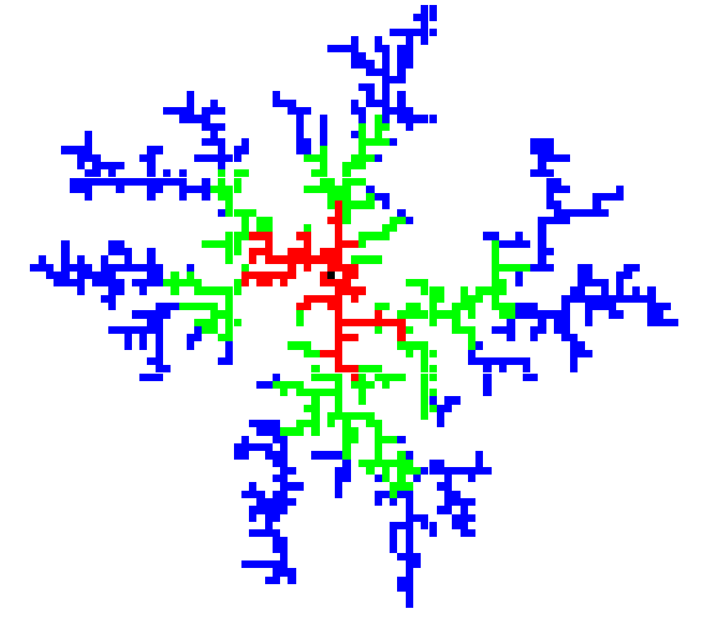
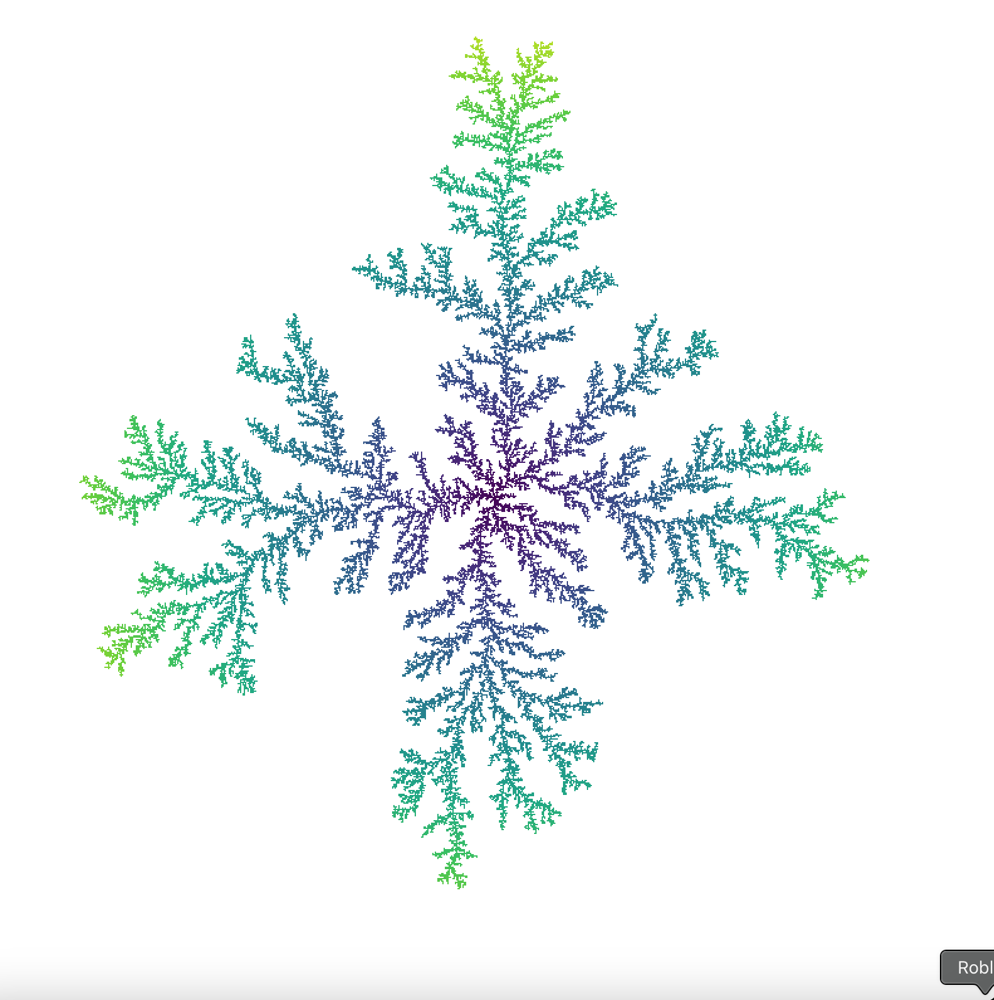
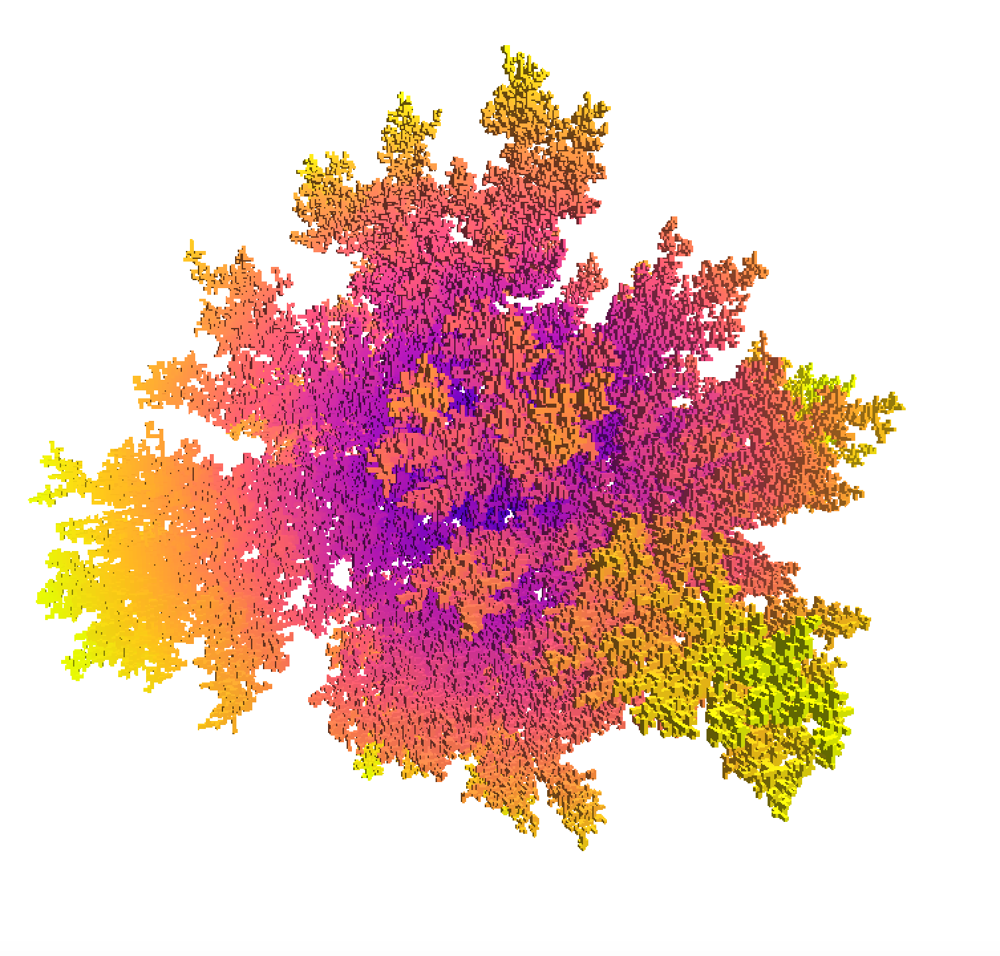
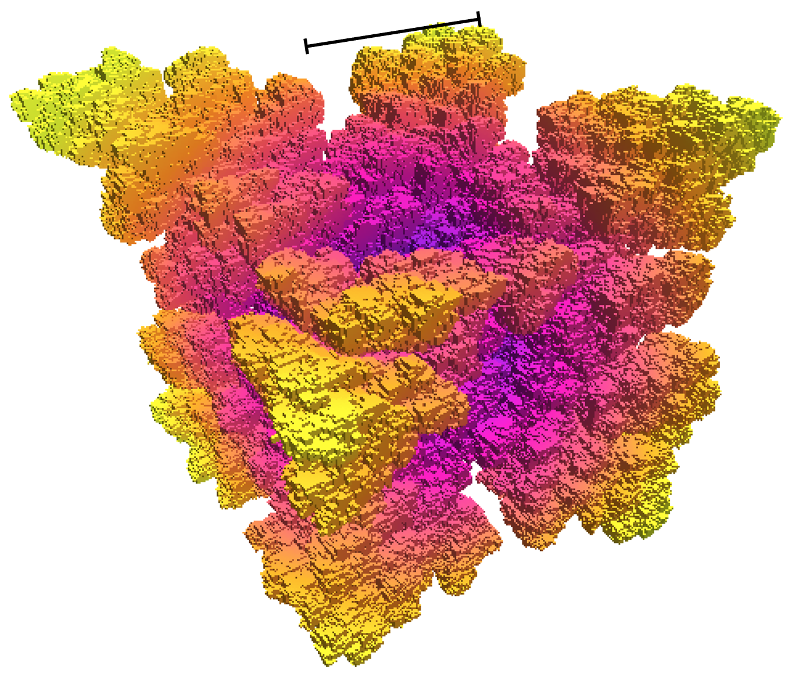
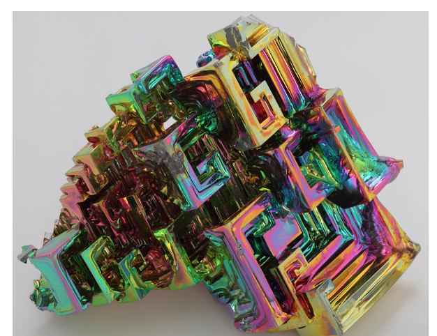

<h1>Diffusion limited aggregation (to an end!)</h1>

<h2>Motivation</h2>
This was a piece of university coursework that was meant to have little emphasis on the coding, with code for a simple 2D simulation given to the cohort.
Not only was the code restricted to 2D, but it was wildly inefficient. On top of this,
I wanted to try to replicate realities with a slightly more sophisticated DLA algorithm.

<h2>Aggregates</h2>

DLA is a subject of interest in many areas of science, and has been around for nearly 4 decades. It involves spawning a particle far away from a cluster of particles, and letting it
execute a random walk until it hits the aggregate, at which point it sticks, and the process repeats with this new cluster. Below are diagrams to aid this explanation:

A walker (a) spawns a set radius from the initial node (c), and exectutes a random walk. When it hits the cluster (e.g. at (b)) it sticks, and the process repeats. After 1000 repititions the cluster looks something like:

Different colours (here) represent the time the particle hit the cluster.

Working with an optimised algorithm, much larger clusters can be generated. Below are two, in 2d (left) and 3D (right).

 

Finally, by modifying the <i>probability</i> that a particle sticks if it hits the cluster to be related to the number of bonds it would be forming (what a mouthful), the below cluster (left) was generated. The change made was a simple model of how Bismuth (right) crystallises under certain conditions.

 

The scale line represents 200 lattice units.

The generated cube has around 2 million 'atoms' comprising it, while the block of bismuth has many orders of magnitude more. The point here is to note their similar attributes: staircase-like substructures and a higher level of cubicity in the cluster than the above, branchy 3D cluster.

